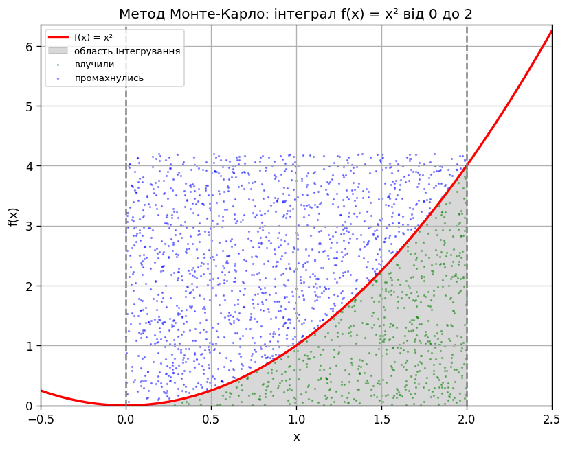

# EX 1
# Видача решти: жадібний алгоритм проти динамічного програмування

Порівняння двох підходів до задачі видачі решти для набору номіналів `[50, 25, 10, 5, 2, 1]`.

## Реалізація

* `find_coins_greedy(amount)`: жадібний алгоритм: на кожному кроці береться найбільший номінал, що не перевищує залишок.
* `find_min_coins(amount)`: динамічне програмування: таблиця `min_coins` заповнюється знизу вгору для всіх сум від 1 до потрібної, набір монет відновлюється за масивом `last_coin`.

Обидві функції приймають необов'язковий параметр `coins`, що дозволяє перевірити поведінку на інших наборах номіналів.

## Складність

| Алгоритм | Час | Пам'ять |
|---|---|---|
| Жадібний | O(m log m) на сортування, далі O(m) | O(m) |
| Динамічне програмування | O(amount · m) | O(amount) |

Тут `m` це кількість номіналів (у нашому випадку 6), `amount` це сума решти.

Принципова відмінність: у жадібного алгоритму складність **не залежить від суми взагалі**. Кожен номінал обробляється рівно один раз через `divmod`, тому сума 10 і сума 10 000 000 коштують однаково. У ДП складність лінійна за сумою, оскільки заповнюється таблиця з `amount + 1` комірок.

## Результати вимірювань

### Коректність

Для набору `[50, 25, 10, 5, 2, 1]` обидва алгоритми дають **однакову кількість монет на всіх сумах від 1 до 2999** (перевірено повним перебором, розбіжностей 0).

| Сума | Жадібний | ДП | Набір |
|---:|---:|---:|---|
| 113 | 5 | 5 | `{50: 2, 10: 1, 2: 1, 1: 1}` |
| 99 | 6 | 6 | `{50: 1, 25: 1, 10: 2, 2: 2}` |
| 63 | 4 | 4 | `{50: 1, 10: 1, 2: 1, 1: 1}` |

### Час виконання

| Сума | Жадібний, с | ДП, с | Відношення |
|---:|---:|---:|---:|
| 100 | 0.00000082 | 0.00003082 | 37x |
| 1 000 | 0.00000062 | 0.00035200 | 564x |
| 10 000 | 0.00000061 | 0.00396810 | 6 526x |
| 100 000 | 0.00000069 | 0.05098374 | 74 320x |
| 500 000 | 0.00000071 | 0.25156332 | 355 818x |

Час жадібного алгоритму лишається сталим на рівні 0.6–0.8 мікросекунди на всьому діапазоні, тоді як час ДП зростає **строго лінійно**: збільшення суми у 10 разів дає зростання часу приблизно у 10 разів (0.0004 -> 0.004 -> 0.05). Це і є пряме емпіричне підтвердження оцінок O(m) та O(amount · m).

## Висновки

**1. Для цього набору номіналів жадібний алгоритм оптимальний і швидший на порядки.** Він видає рівно ту саму мінімальну кількість монет, що й ДП, але на сумі 500 000 працює у 355 тисяч разів швидше. Для касового апарата вибір очевидний.

**2. Причина не у везінні, а у властивості набору.** Набір `[50, 25, 10, 5, 2, 1]` є канонічним: у ньому кожен номінал достатньо «покриває» комбінації менших, тому локально оптимальний вибір завжди веде до глобального оптимуму. Реальні валютні системи проєктуються саме канонічними, і це не випадковість.

**3. Жадібний алгоритм ламається на неканонічних наборах.** Контрприклад з коду: номінали `[1, 3, 4]`, сума 6.

   * Жадібний бере 4, потім 1 і 1, всього **3 монети**.
   * ДП знаходить 3 + 3, всього **2 монети**.

   Тут жадібний вибір найбільшого номіналу заганяє алгоритм у гіршу гілку, з якої немає виходу, бо він ніколи не переглядає прийняті рішення. ДП розглядає всі варіанти для кожної проміжної суми і тому гарантує оптимум завжди.

**4. Ціна гарантії це час і пам'ять.** ДП витрачає O(amount) пам'яті, тому на великих сумах він не просто повільний, а й починає споживати помітний обсяг оперативної пам'яті: для суми 10 000 000 таблиця займе десятки мегабайтів, тоді як жадібний алгоритм обійдеться кількома змінними.

**5. Практичний висновок.** Вибір алгоритму визначається не тим, який з них «розумніший», а властивостями вхідних даних:

   * набір номіналів фіксований і канонічний (звичайна каса) -> **жадібний**, він оптимальний і має константний час;
   * набір номіналів довільний, змінюється або задається ззовні -> **ДП**, бо тільки він гарантує мінімум;
   * компроміс: перевірити набір на канонічність один раз при старті системи і далі використовувати жадібний алгоритм, а ДП тримати як запасний варіант.

Це той самий урок, що і з передобробкою сортування: оптимізація має сенс лише у прив'язці до конкретних властивостей задачі, а не сама по собі.


---------------------------------------------------------------
# EX2
---------------------------------------------------------------
# Обчислення визначеного інтеграла методом Монте-Карло

Обчислення інтеграла функції `f(x) = x²` на відрізку `[0, 2]` двома варіантами методу Монте-Карло з перевіркою та аналітичний розрахунок.

## Постановка задачі

Аналітичне значення:
```
∫₀² x² dx = x³/3 |₀² = 8/3 ≈ 2.6666666667
```
Запуск: `python monte_carlo_integration.py`



Зеленим показано точки, що потрапили під криву, синім ті, що промахнулись. Відношення їхньої кількості і дає оцінку площі.

## Реалізовані варіанти

**Hit-or-miss («влучив або промахнувся»).** Навколо області будується прямокутник `[a, b] × [0, y_max]`, у нього кидається n випадкових точок. Оцінка інтеграла дорівнює площі прямокутника, помноженій на частку точок під кривою.

**Метод середнього значення.** Інтеграл дорівнює `(b - a)` помножити на середнє значення функції у n випадкових точках відрізка. Використовує самі значення функції, а не бінарний факт влучання, тому має меншу дисперсію.

## Результати

Еталонні значення:

| Джерело | Значення | Похибка |
|---|---|---|
| Аналітично (8/3) | 2.6666666667 | 0 |
| `scipy.integrate.quad` | 2.6666666667 | 2.96e-14 |

Оцінки Монте-Карло:

| n | Hit-or-miss | Похибка | Середнє значення | Похибка |
|---:|---:|---:|---:|---:|
| 100 | 2.772000 | 3.9500% | 2.488111 | 6.6958% |
| 1 000 | 2.595600 | 2.6650% | 2.656984 | 0.3631% |
| 10 000 | 2.679600 | 0.4850% | 2.641543 | 0.9421% |
| 100 000 | 2.676828 | 0.3811% | 2.670950 | 0.1606% |
| 1 000 000 | 2.667319 | 0.0245% | 2.666695 | **0.0011%** |
| 10 000 000 | 2.663630 | 0.1139% | 2.665998 | 0.0251% |

## Перевірка збіжності

Теорія стверджує, що похибка методу Монте-Карло спадає як `1/√n`. Отже, при збільшенні n у 4 рази стандартне відхилення оцінок має зменшитись приблизно вдвічі. Перевірка на 200 незалежних запусках з різними зернами:

| n | Середнє | Ст. відхилення | Відношення до попереднього |
|---:|---:|---:|---:|
| 1 000 | 2.666522 | 0.079102 | - |
| 4 000 | 2.672008 | 0.035060 | 2.26x |
| 16 000 | 2.667302 | 0.016445 | 2.13x |
| 64 000 | 2.667287 | 0.008772 | 1.87x |

Відношення тримається біля 2, що **підтверджує теоретичну оцінку `O(1/√n)`**. Середнє по 200 запусках при цьому збігається з аналітичним значенням до третього знака вже на n = 1000, тобто оцінка є незміщеною: помиляються окремі запуски, а не метод.

## Висновки

**1. Метод Монте-Карло дає правильний результат.** На мільйоні точок метод середнього значення дав 2.666695 проти аналітичних 2.666667, тобто похибку 0.0011%. Результат `quad` збігається з аналітичним з точністю 1e-14, і саме до нього збігаються оцінки Монте-Карло при зростанні n.

**2. Метод середнього значення точніший за hit-or-miss.** На тій самій кількості точок він стабільно виграє (0.0011% проти 0.0245% на мільйоні). Причина в тому, що hit-or-miss зводить кожну точку до одного біта інформації (влучила чи ні) і додатково залежить від того, наскільки щільно прямокутник охоплює область: чим більше порожнього місця над кривою, тим більше точок витрачається даремно.

**3. Похибка спадає повільно і немонотонно.** Це головна практична особливість методу. У таблиці видно, що на n = 10 000 000 похибка виявилась **гіршою**, ніж на n = 1 000 000 (0.0251% проти 0.0011%), хоча точок у 10 разів більше. Протиріччя тут немає: це один конкретний запуск з фіксованим зерном, а окремій реалізації випадкової величини не заборонено відхилитись. Саме тому оцінювати збіжність за одним запуском неможливо, і в таблиці вище використано усереднення по 200 запусках.

**4. Ціна точності зростає квадратично.** З оцінки `O(1/√n)` випливає, що для десятикратного зменшення похибки потрібно у 100 разів більше точок. Тому Монте-Карло безнадійно програє детермінованим методам на одновимірних гладких функціях: `quad` дає 14 знаків миттєво, а Монте-Карло не дасть і 5 знаків за розумний час.

**5. Де метод справді потрібен.** Швидкість збіжності `1/√n` **не залежить від розмірності задачі**, тоді як у сіткових методів кількість вузлів зростає експоненційно (для d вимірів це N^d точок). Тому на інтегралах розмірності 5 і вище Монте-Карло стає єдиним практичним варіантом. Так само він працює там, де область інтегрування задана складною умовою, а не аналітичною формулою.

**Підсумок:** для задачі з цього завдання (одновимірний інтеграл гладкої функції) метод Монте-Карло є правильним, але явно надлишковим інструментом. Його цінність не в точності, а в універсальності: він однаково працює для будь-якої функції та області, не вимагаючи від них ані гладкості, ані низької розмірності.
